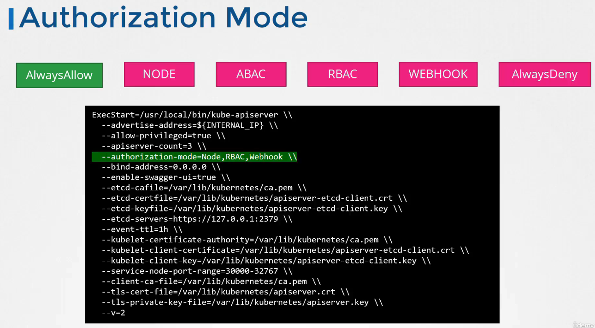

# 쿠버네티스에서의 권한 부여(Authorization)

## 권한 부여의 필요성

클러스터에는 다양한 사용자와 서비스(예: 개발자, 관리자, CI/CD 도구 등)가 있으며, 각각 다른 권한을 부여받아야 합니다. 이는 클러스터의 보안을 유지하고, 필요한 작업만을 수행할 수 있도록 하기 위함입니다.

## 권한 부여 메커니즘

쿠버네티스는 여러 권한 부여 메커니즘을 지원합니다:

- **Node Authorizer**: 노드 관련 요청을 처리합니다.
- **Attribute-based Access Control (ABAC)**: 사용자나 그룹에 특정 권한을 연결합니다.
- **Role-Based Access Control (RBAC)**: 역할을 정의하고, 사용자나 그룹을 해당 역할에 연결하여 권한을 관리합니다.
- **Webhook**: 외부 서비스를 통해 권한 부여 결정을 내립니다.
- **AlwaysAllow**
- **AlwaysDeny**
  

## RBAC(Role-Based Access Control)

RBAC는 권한 부여를 관리하기 위한 효율적인 방법입니다. 역할을 정의하고, 사용자나 그룹을 역할에 매핑함으로써 권한을 관리합니다.

### RBAC 예시 구성

1. **역할(Role) 생성**

   ```yaml
   kind: Role
   apiVersion: rbac.authorization.k8s.io/v1
   metadata:
     namespace: default
     name: pod-manager
   rules:
     - apiGroups: [""]
       resources: ["pods"]
       verbs: ["create", "delete", "get"]
   ```

2. **역할 바인딩(RoleBinding) 생성**
   ```yaml
   kind: RoleBinding
   apiVersion: rbac.authorization.k8s.io/v1
   metadata:
     name: pod-manager-binding
     namespace: default
   subjects:
     - kind: User
       name: jane
       apiGroup: rbac.authorization.k8s.io
   roleRef:
     kind: Role
     name: pod-manager
     apiGroup: rbac.authorization.k8s.io
   ```

## API 서버에서 권한 부여 모드 설정

권한 부여 모드는 API 서버 시작 시 `--authorization-mode` 옵션을 통해 설정합니다. 예를 들어, RBAC와 Webhook을 사용하고자 할 때는 다음과 같이 설정할 수 있습니다:

```bash
--authorization-mode=Node,RBAC,Webhook
```

## 결론

권한 부여는 쿠버네티스 클러스터의 중요한 보안 요소입니다. 올바른 권한 부여 메커니즘을 선택하고 구성하는 것은 클러스터의 보안을 강화하고, 필요한 작업만을 수행할 수 있도록 합니다.

## K8s Reference Docs

https://kubernetes.io/docs/reference/access-authn-authz/authorization/
