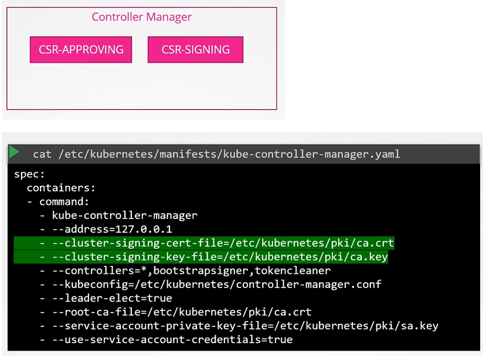

# 쿠버네티스의 인증서 API 활용하기

쿠버네티스에는 CA(인증 기관)를 내장하고 있으며, 인증서 서명 요청(CSR)을 처리할 수 있는 인증서 API가 포함되어 있습니다. 사용자는 OpenSSL과 같은 도구를 사용하여 CSR을 생성하고, 이를 쿠버네티스에 제출하여 인증서를 발급받을 수 있습니다.

## 인증서 서명 요청(CSR) 생성 및 제출

1. **사용자 개인 키 생성**

   ```bash
   openssl genrsa -out jane.key 2048
   ```

2. **CSR 생성**

   ```bash
   openssl req -new -key jane.key -subj "/CN=jane" -out jane.csr
   ```

3. **CSR을 쿠버네티스에 제출**
   - CSR 파일을 Base64 인코딩하고, 인코딩된 CSR을 포함하는 YAML 파일을 생성합니다.
   ```yaml
   apiVersion: certificates.k8s.io/v1
   kind: CertificateSigningRequest
   metadata:
     name: jane
   spec:
     expirationSeconds: 600
     groups:
       - system:authenticated
     usages:
       - digital signature
       - key encipherment
       - server auth
     request: <Base64-encoded-certificate> # cat jane.csr | base64 -w 0
   ```
   - YAML 파일을 사용하여 CSR 객체를 쿠버네티스에 생성합니다.
     ```bash
     kubectl create -f jane.yaml
     ```

## CSR 승인 및 인증서 추출

1. **CSR 목록 조회**

   ```bash
   kubectl get csr
   ```

2. **CSR 승인**

   ```bash
   kubectl certificate approve jane
   ```

3. **인증서 확인 및 디코딩**
   ```bash
   kubectl get csr jane -o yaml
   echo "<certificate> " |base64 --decode
   kubectl get csr jane -o yaml | grep 'certificate:' | cut -d ' ' -f 6 | base64 --decode
   ```

## 주요 포인트

- 쿠버네티스의 인증서 API를 사용하면 사용자가 직접 CSR을 제출하고 관리자가 이를 승인할 수 있습니다.
- 이 과정을 통해 안전하게 인증서를 발급받고, 클러스터 내에서 사용할 수 있습니다.
- 모든 인증서 관련 작업은 컨트롤러 매니저에 의해 처리되며, CA의 루트 인증서와 개인 키가 필요합니다.

이 절차를 통해 쿠버네티스 클러스터 내에서 인증서를 효과적으로 관리할 수 있으며, 사용자와 서버 간의 안전한 통신을 보장할 수 있습니다.


## K8s Reference Docs

https://kubernetes.io/docs/reference/access-authn-authz/certificate-signing-requests/
https://kubernetes.io/docs/tasks/tls/managing-tls-in-a-cluster/
