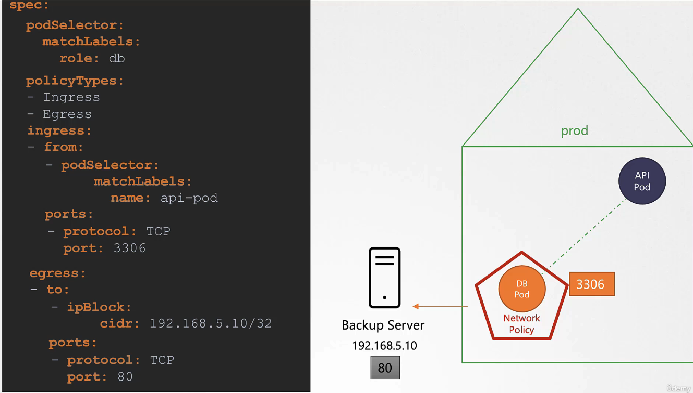

# 네트워크 정책 상세 설명

## 개요

네트워크 정책을 통해 특정 파드가 특정 파드로부터만 트래픽을 받도록 구성할 수 있습니다. 이 예에서는 데이터베이스 파드가 API 파드에서 오는 트래픽만 받도록 설정합니다.

## 정책 생성 절차

1. **네트워크 정책 객체 생성**: 먼저 `NetworkPolicy` 객체를 생성하여 데이터베이스 파드에 적용합니다.
2. **파드 선택기 설정**: `podSelector`를 사용하여 정책을 적용할 파드를 지정합니다.
3. **정책 유형 정의**: `Ingress` 정책을 사용하여 들어오는 트래픽에 대한 규칙을 정의합니다.
4. **트래픽 허용 규칙 설정**: API 파드에서 오는 트래픽을 허용하도록 규칙을 설정합니다.

```yaml
apiVersion: networking.k8s.io/v1
kind: NetworkPolicy
metadata:
  name: db-policy
spec:
  podSelector:
    matchLabels:
      role: db
  policyTypes:
    - Ingress
  ingress:
    - from:
        - podSelector:
            matchLabels:
              name: api-pod
      ports:
        - protocol: TCP
          port: 3306
```

### Namespace Selector

특정 네임스페이스에서만 트래픽을 허용하도록 `namespaceSelector`를 추가할 수 있습니다.

```yaml
apiVersion: networking.k8s.io/v1
kind: NetworkPolicy
metadata:
  name: db-policy
spec:
  podSelector:
    matchLabels:
      role: db
  policyTypes:
    - Ingress
  ingress:
    - from:
        - namespaceSelector:
            matchLabels:
              name: prod
      ports:
        - protocol: TCP
          port: 3306
```

### IP 블록

특정 IP 주소 범위에서 트래픽을 허용하려면 `ipBlock`을 사용하여 규칙을 추가할 수 있습니다.

```yaml
apiVersion: networking.k8s.io/v1
kind: NetworkPolicy
metadata:
  name: db-policy
spec:
  podSelector:
    matchLabels:
      role: db
  policyTypes:
    - Ingress
  ingress:
    - from:
        - podSelector:
            matchLabels:
              name: api-pod
          namespaceSelector:
            matchLabels:
              name: prod
          ipBlock:
            cidr: 192.168.5.10/32
      ports:
        - protocol: TCP
          port: 3306
```


### egress

```yaml
apiVersion: networking.k8s.io/v1
kind: NetworkPolicy
metadata:
  name: db-policy
spec:
  podSelector:
    matchLabels:
      role: db
  policyTypes:
    - Ingress
    - Egress
  ingress:
    - from:
        - podSelector:
            matchLabels:
              name: api-pod
      ports:
        - protocol: TCP
          port: 3306
  egress:
    - to:
        - ipBlock:
          cidr: 192.198.5.10/32
      port:
        - protocal: TCP
          port: 80
```


