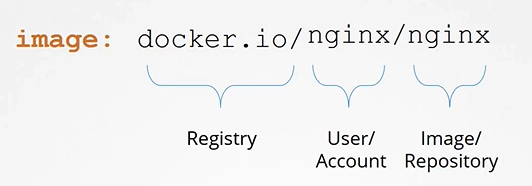

# 쿠버네티스에서의 이미지 보안

쿠버네티스 클러스터에서 파드를 배포할 때 사용되는 이미지는 중요한 보안 고려 사항입니다. 이 강의에서는 이미지 이름의 기본 구조부터 시작하여, 보안 이미지 저장소를 설정하고 사용하는 방법을 배웁니다.

## 이미지 이름 이해하기


Docker 및 쿠버네티스에서 이미지 이름은 `도커 허브(Docker Hub)`의 기본 저장소에서 이미지를 가져오는 데 사용됩니다. 예를 들어, `nginx` 이미지는 사실 `library/nginx`로 참조됩니다. 여기서 `library`는 Docker의 공식 이미지가 저장된 기본 계정 이름입니다.

## 보안 이미지 저장소 사용하기

공개적으로 접근 가능한 이미지 외에도, 비공개적으로 관리되어야 할 이미지들이 있습니다. 이러한 이미지는 보안이 강화된 개인 저장소에 저장될 수 있으며, 접근하기 위해서는 인증이 필요합니다.

1. **개인 저장소 인증**
   Docker 이미지를 비공개 저장소에서 관리할 때는 `docker login` 명령어를 사용하여 로그인합니다.

   ```bash
   docker login private-registry.io
   docker run private-registry.io/apps/internal-app
   ```

2. **쿠버네티스에서 인증 정보 관리**
   자격 증명이 포함된 비밀 개체를 만듭니다.

   ```bash
    kubectl create secret docker-registry regcred \
    --docker-server=private-registry.io \
    --docker-username=registry-user \
    --docker-password=registry-password \
    --docker-email=registry-user@org.com
   ```

   파드 정의 파일에 `imagePullSecrets` 섹션으로 포함시켜 사용합니다.

3. **파드에 이미지 풀 시크릿 적용하기**
   파드를 생성할 때, 이미지를 풀할 인증 정보로 Secret을 지정할 수 있습니다.
   ```yaml
   apiVersion: v1
   kind: Pod
   metadata:
     name: myapp-pod
   spec:
     containers:
       - name: myapp-container
         image: myregistry.com/myapp
     imagePullSecrets:
       - name: regcred
   ```

## K8s Reference Docs

https://kubernetes.io/docs/concepts/containers/images/
