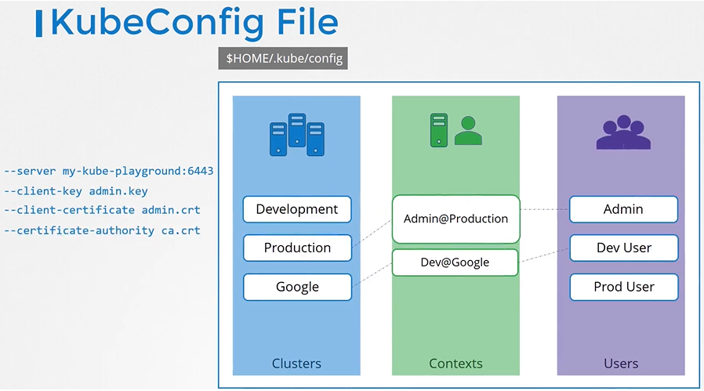
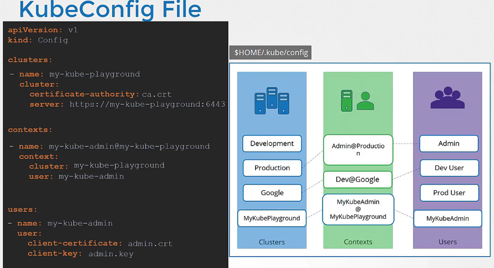
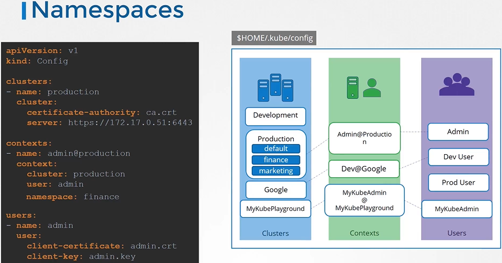
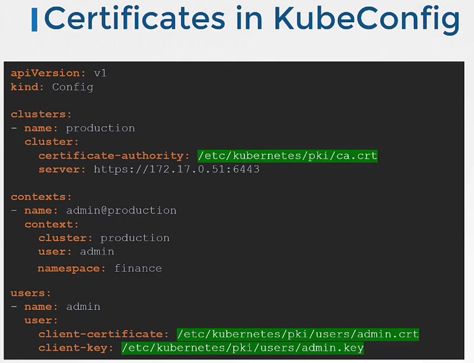
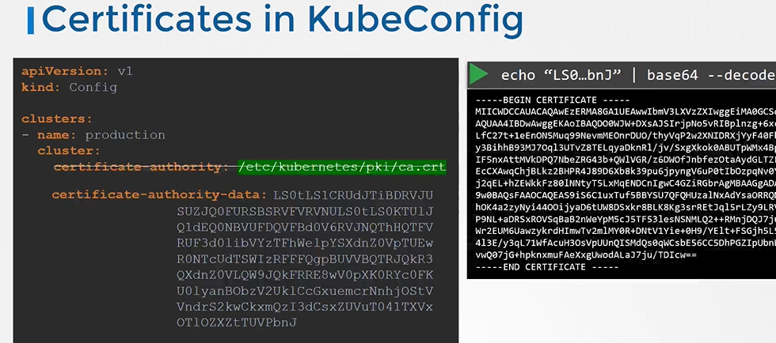

# Kubeconfig 파일 이해 및 사용

Kubeconfig 파일은 쿠버네티스 클라이언트가 클러스터와 통신할 때 필요한 구성 정보를 담고 있습니다.

## Kubeconfig 파일의 주요 섹션



1. **Clusters**: 접근해야 하는 쿠버네티스 클러스터의 리스트입니다.
2. **Users**: 클러스터에 접근하는 데 사용할 사용자 계정의 리스트입니다.
3. **Contexts**: 어떤 사용자가 어떤 클러스터에 접근할지를 정의하는 설정입니다.

## Kubeconfig 파일 생성 및 구성 예시



1. **클러스터 설정 추가**
   ```yaml
   clusters:
     - name: my-kube-playground
       cluster:
         certificate-authority: /path/to/ca.crt
         server: https://my-kube-api-server:6443
   ```
2. **사용자 설정 추가**

   ```yaml
   users:
     - name: my-kube-admin
       user:
         client-certificate: /path/to/admin.crt
         client-key: /path/to/admin.key
   ```

3. **컨텍스트 설정 추가**

   ```yaml
   contexts:
     - name: my-kube-admin@my-kube-playground
       context:
         cluster: my-kube-playground
         user: my-kube-admin
   ```

4. **현재 컨텍스트 설정**

   ```yaml
   current-context: my-kube-admin@my-kube-playground
   ```

5. **command**

- kubeconfig 조회
  ```bash
  kubectl config view
  kubectl config veiw --kubeconfig=my-custom-config
  kubectl config current-context --kubeconfig=my-kube-config
  ```
- context 변경
  ```bash
  kubectl config use-context <context-name>
  kubectl config use-context prod-user@production
  ```

## Kubeconfig 사용하기

- `kubectl` 명령어 실행 시 `--kubeconfig` 옵션으로 kubeconfig 파일을 지정할 수 있습니다.
- 사용자 홈 디렉토리 아래의 `.kube/config` 파일을 기본 kubeconfig 파일로 사용합니다.

## 컨텍스트 변경하기

- 다른 컨텍스트로 변경하려면, `kubectl config use-context` 명령어를 사용합니다.
  ```bash
  kubectl config use-context my-kube-admin@my-kube-playground
  ```

## Namespaces



## 인증서 데이터 직접 포함시키기




- kubeconfig 파일에 인증서 파일의 경로 대신 인증서의 Base64 인코딩된 데이터를 직접 포함시킬 수 있습니다.
  ```yaml
  users:
    - name: my-kube-admin
      user:
        client-certificate-data: <base64-encoded-cert>
        client-key-data: <base64-encoded-key>
  ```

## K8s Reference Docs

https://kubernetes.io/docs/tasks/access-application-cluster/configure-access-multiple-clusters/
https://kubernetes.io/docs/reference/generated/kubectl/kubectl-commands#config
