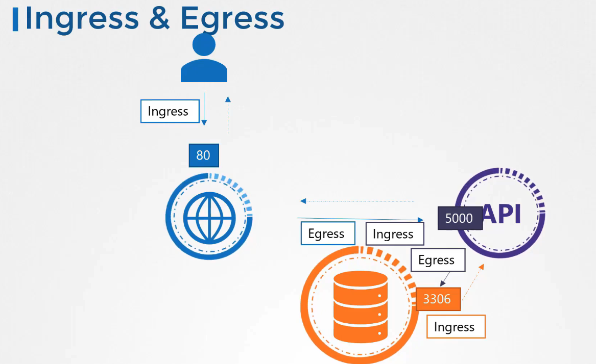
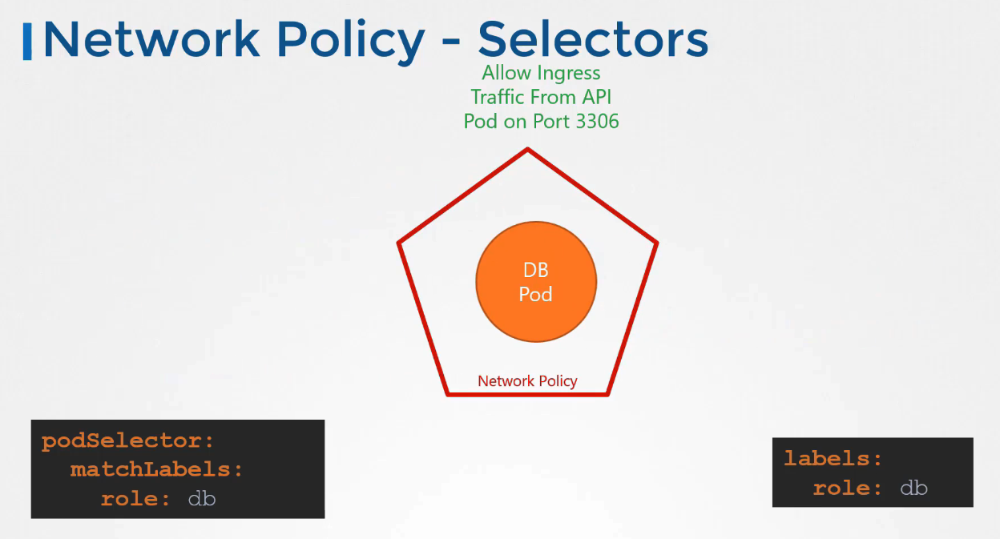
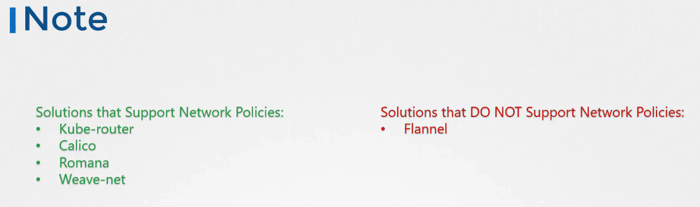

# 쿠버네티스 네트워크 정책

## 기본 개념


네트워크 정책은 클러스터 내의 트래픽 흐름을 제어하여 파드가 서로 또는 다른 네트워크 엔드포인트와 어떻게 소통할지 결정합니다. 이 정책은 특정 파드가 특정 포트로 트래픽을 받거나 보내는 것을 허용하거나 차단할 수 있습니다.

### 인그레스(Ingress) 및 이그레스(Egress)

- **인그레스**: 외부로부터 파드로 들어오는 트래픽을 제어합니다.
- **이그레스**: 파드에서 외부로 나가는 트래픽을 제어합니다.

## 네트워크 정책 적용 예시


웹 서버, API 서버, 데이터베이스 서버 구성 예를 통해 인그레스 및 이그레스 규칙을 설명합니다. 아래는 각 서비스에 대한 네트워크 정책 정의의 예시입니다.

```yaml
apiVersion: networking.k8s.io/v1
kind: NetworkPolicy
metadata:
  name: db-policy
spec:
  podSelector:
    matchLabels:
      role: db
  policyTypes:
    - Ingress
  ingress:
    - from:
        - podSelector:
            matchLabels:
              name: api-pod
      ports:
        - protocol: TCP
          port: 3306
```

### 네트워크 정책 조회

```bash
kubectl get netpol
```

### 네트워크 정책 생성

네트워크 정책을 생성하는 과정은 `kubectl create` 커맨드를 사용하여 YAML 파일로 정의된 정책을 쿠버네티스에 적용하는 것을 포함합니다.

### 네트워크 정책 적용 확인

파드에 정책이 제대로 적용되었는지 확인하기 위해 `kubectl describe networkpolicy` 커맨드를 사용하여 정책에 정의된 규칙을 검토할 수 있습니다.

## Note



## K8s Reference Docs

https://kubernetes.io/docs/concepts/services-networking/network-policies/
https://kubernetes.io/docs/tasks/administer-cluster/declare-network-policy/
