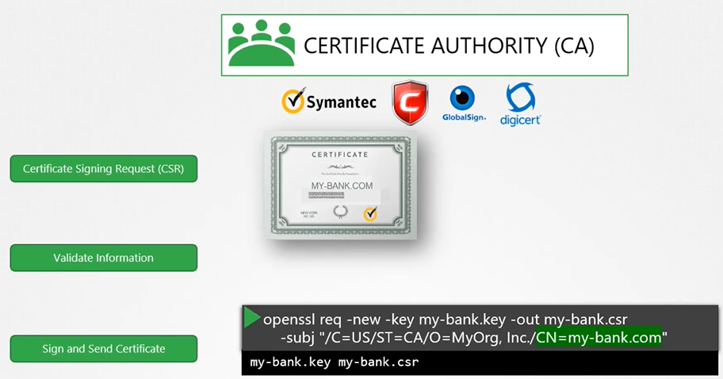

# SSL/TLS 인증서 이해하기

## TLS 인증서란?

TLS(전송 계층 보안) 인증서는 사용자와 서버 간의 통신을 암호화하여, 서버가 자신이라고 주장하는 것이 실제로 맞는지를 보증하는 디지털 인증서입니다.

## 왜 TLS 인증서가 필요한가?

- **보안 향상**: 사용자와 서버 간의 통신을 암호화하여, 중간자 공격에 대한 보호를 제공합니다.
- **신뢰성**: 서버가 주장하는 정체성을 검증하여 사용자에게 신뢰를 제공합니다.

## 인증서로 SSH 또는 웹 서버 보안 구성하기

### SSH 키 쌍 생성

```bash
ssh-keygen -t rsa -b 4096
```

이 명령어는 개인 키(`id_rsa`)와 공개 키(`id_rsa.pub`)를 생성합니다.

### 공개 키를 서버에 배포

공개 키를 서버의 `~/.ssh/authorized_keys` 파일에 추가하여, 해당 서버에 대한 비밀번호 없는 SSH 접속을 활성화합니다.

### 웹 서버에 TLS 인증서 구성

1. **키 생성 및 CSR(인증서 서명 요청) 생성**

   ```bash
   openssl genras -out -my-bank.key 1024
   openssl rsa -in my-bank.key -pubout > mybank.pem
   ```

   이 명령어는 개인 키(`server.key`)와 CSR(`server.csr`)을 생성합니다.

2. **CSR을 CA(인증 기관)에 제출하여 인증서 받기**
   
   CSR을 CA에 제출하고, 검증 과정을 통과하면 서명된 인증서를 받습니다.

3. **서버에 인증서 구성**
   받은 인증서(`server.crt`)와 개인 키(`server.key`)를 사용하여 서버를 구성합니다.

## 주의사항

- **암호화의 종류**: 대칭 암호화와 비대칭 암호화에 대해 이해하고 올바르게 사용해야 합니다.
- **인증서의 신뢰성**: CA에 의해 서명된 인증서만이 사용자와 웹 브라우저에서 신뢰할 수 있습니다.
- **보안 강화**: SSH 접속 및 웹 서버 구성 시, 강력한 암호화 키를 사용하고 주의 깊게 관리해야 합니다.

이 정보가 SSL/TLS 인증서의 기본 개념을 이해하는 데 도움이 되기를 바랍니다. 추가적인 질문이나 도움이 필요한 경우 언제든지 문의해 주세요.
