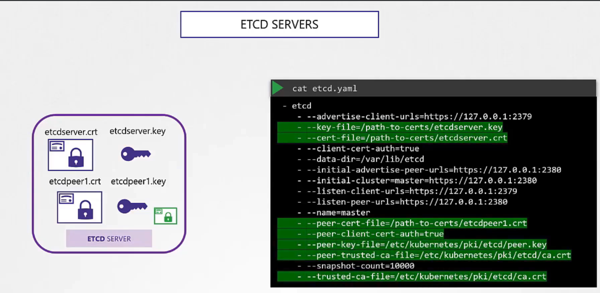
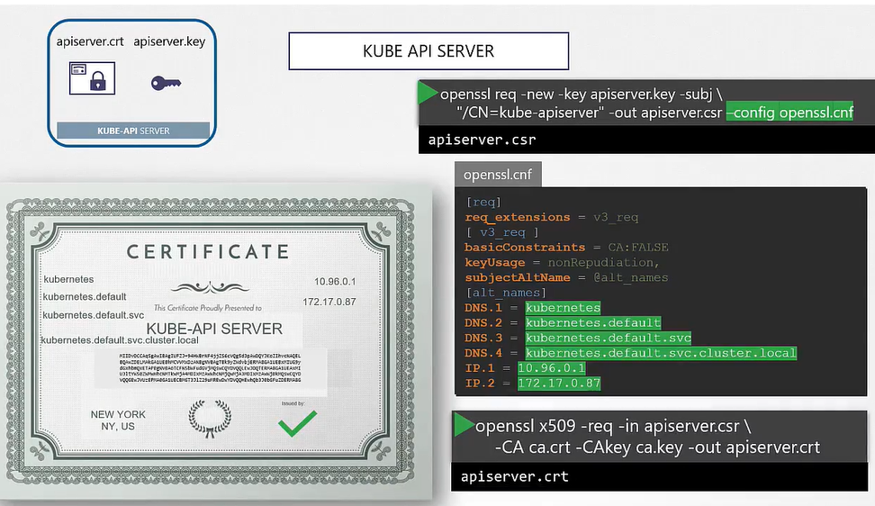
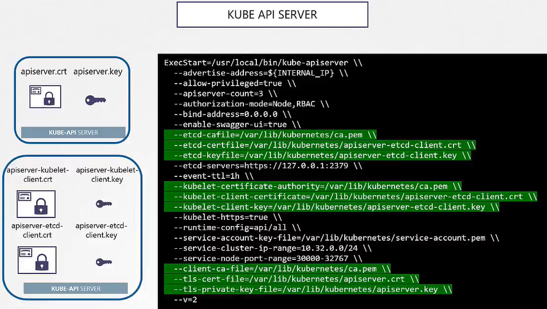
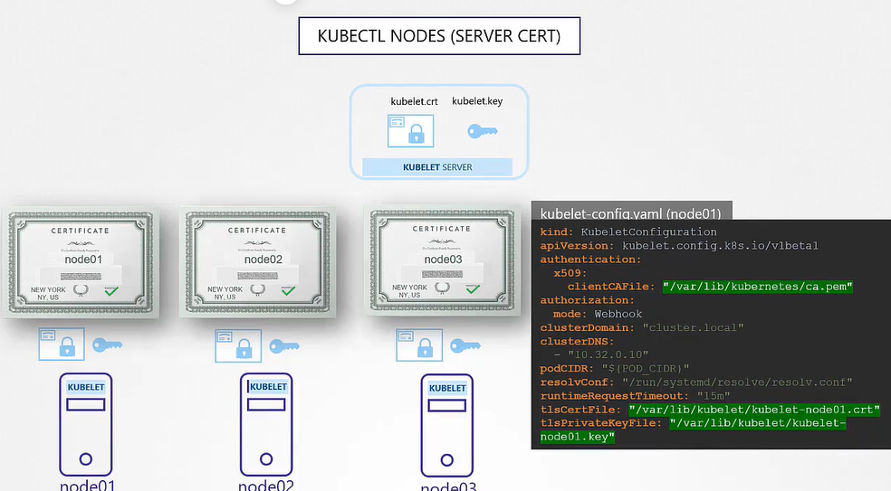
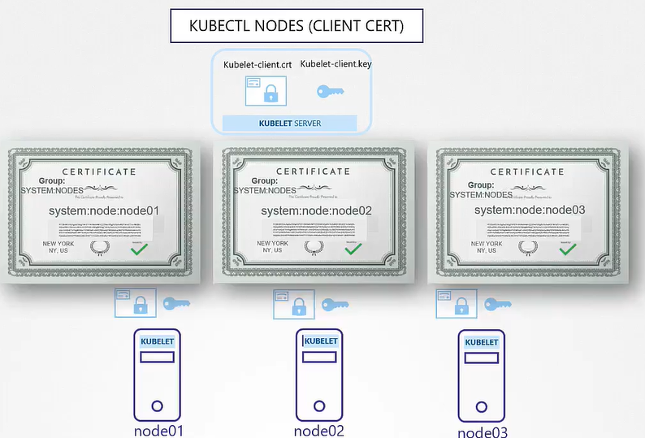

# 쿠버네티스 클러스터 인증서 생성

## CA(인증 기관) 인증서 생성

1. **CA 개인 키 생성**
   ```bash
   openssl genrsa -out ca.key 2048
   ```
2. **CA 인증서 서명 요청(CSR) 생성**
   ```bash
   openssl req -new -key ca.key -subj "/CN=Kubernetes-CA" -out ca.csr
   ```
3. **CA 자체 서명 인증서 생성**
   ```bash
   openssl x509 -req -in ca.csr -signkey ca.key -out ca.crt
   ```

## 클라이언트 인증서 생성

예시로, 관리자(admin) 사용자의 인증서를 생성하는 방법입니다.

1. **개인 키 생성**
   ```bash
   openssl genrsa -out admin.key 2048
   ```
2. **CSR 생성**
   ```bash
   openssl req -new -key admin.key -subj "/CN=kube-admin/O=system:masters" -out admin.csr
   ```
   - `/O=system:masters`는 해당 사용자에게 쿠버네티스 클러스터의 관리자 권한을 부여합니다.
3. **CA로부터 서명된 인증서 생성**
   ```bash
   openssl x509 -req -in admin.csr -CA ca.crt -CAkey ca.key -out admin.crt
   ```

## 서버 인증서 생성

kube-apiserver를 위한 인증서 생성 예시입니다.

1. **개인 키 및 CSR 생성**
   - kube-apiserver의 경우, 여러 DNS 이름과 IP 주소를 포함해야 합니다. 이를 위해 OpenSSL 설정 파일에 SAN(Subject Alternative Name)을 포함시킵니다.
2. **서버 인증서 서명 요청 생성**
   - OpenSSL 설정 파일을 사용하여 CSR을 생성하고, 필요한 모든 SAN을 포함시킵니다.
3. **CA로부터 서명된 서버 인증서 생성**
   - CA의 개인 키를 사용하여 CSR을 서명하고, kube-apiserver의 서버 인증서를 생성합니다.

## ETCD Server certificate



## Kube-apiserver certificate


<br/>


## Kubectl Nodes (Server Cert)



## Kubectl Nodes (Client Cert)



## 인증서의 활용

- 생성된 인증서는 클라이언트와 서버 간의 TLS 통신을 안전하게 하기 위해 사용됩니다.
- 예를 들어, kubeconfig 파일에 클라이언트 인증서를 포함시켜 `kubectl`이 클러스터에 안전하게 접근할 수 있도록 합니다.
- 서버 인증서는 해당 서버의 TLS 서비스를 위해 사용되며, 클라이언트가 서버의 신뢰성을 검증할 수 있게 해 줍니다.

## 요약

- 인증서 생성 과정은 클라이언트 및 서버의 안전한 통신을 위한 기반이 됩니다.
- CA 인증서는 클러스터 내에서 인증서의 신뢰 체인의 최상위에 있으며, 모든 인증서 서명에 사용됩니다.
- 각 컴포넌트의 역할과 목적에 맞는 인증서를 생성하고 관리하는 것이 중요합니다.
