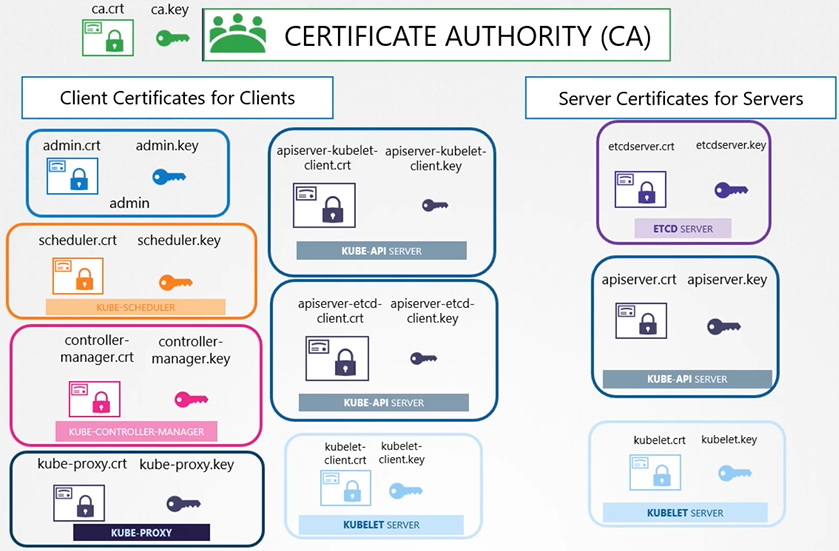
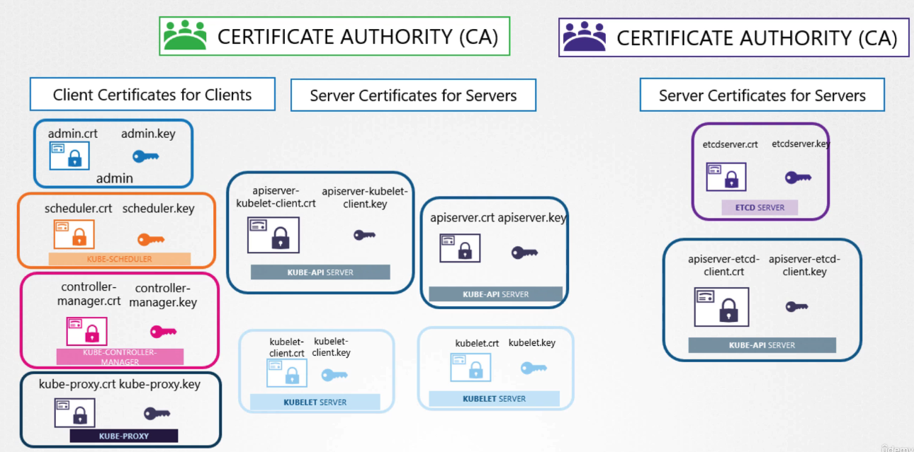

# 쿠버네티스 클러스터의 TLS 인증서 구성

## 인증서 유형

쿠버네티스 클러스터 내에서 주로 세 가지 유형의 인증서가 사용됩니다:

1. **서버 인증서(Server Certificates)**: 클러스터 내 서버들이 클라이언트의 요청을 안전하게 처리할 수 있도록 합니다.
2. **루트 인증서(Root Certificates)**: CA(Certificate Authority)에 의해 사용되며, 다른 인증서를 서명하는 데 사용됩니다.
3. **클라이언트 인증서(Client Certificates)**: 클라이언트가 서버에 자신의 정체성을 증명할 수 있게 해 줍니다.

## 구성 요소별 인증서 요구사항

### kube-apiserver

- 서버 인증서: `apiserver.crt`, `apiserver.key`
- 클라이언트(관리자, 스케줄러, 컨트롤러 매니저 등)로부터의 안전한 통신을 위해 필요합니다.

### etcd

- 서버 인증서: `etcdserver.crt`, `etcdserver.key`
- etcd는 클러스터의 모든 데이터를 저장하므로, 이에 대한 접근은 매우 안전하게 이루어져야 합니다.

### kubelet

- 서버 인증서: `kubelet.crt`, `kubelet.key`
- kube-apiserver와의 안전한 통신을 위해 각 워커 노드에 필요합니다.

### 관리자(Admin)

- 클라이언트 인증서: `admin.crt`, `admin.key`
- kubectl 또는 API를 통해 클러스터를 관리할 때 사용합니다.

### 스케줄러(Scheduler)

- 클라이언트 인증서: `scheduler.crt`, `scheduler.key`

### 컨트롤러 매니저(Controller Manager)

- 클라이언트 인증서: `controller-manager.crt`, `controller-manager.key`

### kube-proxy

- 클라이언트 인증서: `kube-proxy.crt`, `kube-proxy.key`

## 인증서 파일 명명 규칙

- **공개 키 인증서**: `.crt` 또는 `.pem` 확장자를 가집니다. 예: `server.crt`, `client.pem`
- **개인 키**: `.key` 확장자를 가지거나 파일 이름에 `-key`를 포함합니다. 예: `server.key`, `client-key.pem`

## 인증서 생성 및 구성

쿠버네티스 클러스터에서 인증서를 생성하고 구성하는 과정은 다음과 같습니다:

1. CA 인증서(`ca.crt`, `ca.key`) 생성
2. 각 서버 및 클라이언트 인증서를 생성하고, CA에 의해 서명 받음
3. 적절한 구성 요소에 인증서와 키를 구성하여 TLS 보안 통신 활성화

## 요약

- 쿠버네티스 클러스터의 보안은 TLS 인증서를 통해 강화됩니다.
- 서버, 클라이언트, CA의 세 가지 주요 인증서 유형이 있습니다.
- 적절한 명명 규칙과 구성을 통해, 클러스터 내의 안전한 통신을 보장할 수 있습니다.
