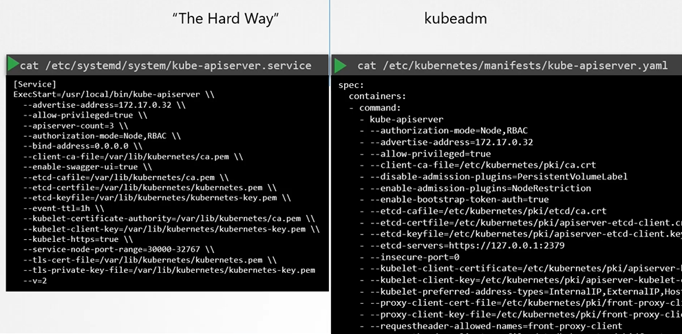
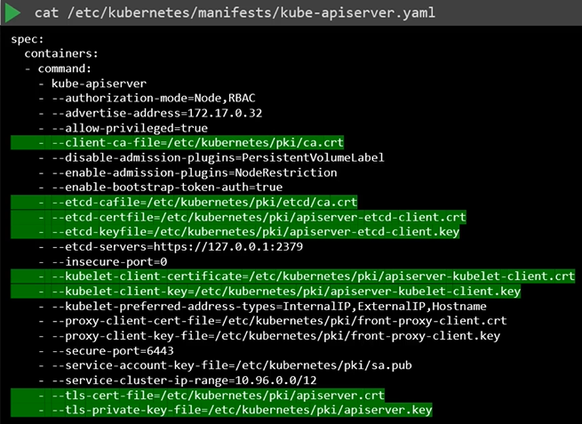
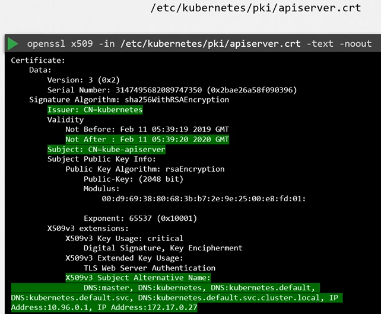

# 쿠버네티스 클러스터 내 인증서 확인하기

클러스터에서 사용되는 다양한 인증서를 확인하고 점검하는 방법을 배웁니다.


## 인증서 정보 확인 방법

1. **클러스터 설정 방법 파악**: 클러스터가 수동으로 설정되었는지, 아니면 Kubeadm과 같은 자동화 도구를 사용하여 설정되었는지 파악합니다.

2. **인증서 파일 위치 확인**: Kubeadm을 사용한 경우, `/etc/kubernetes/manifests` 경로 아래에 있는 `kube-apiserver.yaml` 정의 파일에서 인증서 파일 위치를 확인할 수 있습니다.

```bash
cat /etc/kubernetes/manifest/kube-apiserver.yaml
```



3. **인증서 상세 정보 확인**:
   OpenSSL을 사용하여 인증서의 상세 정보를 확인합니다. 예를 들어, kube-apiserver의 인증서를 확인하기 위해 다음 명령어를 사용합니다.

```bash
openssl x509 -in /path/to/apiserver.crt -text -noout
```

- 이 명령어는 인증서의 주체 이름(CN), 대체 이름(SANs), 유효 기간, 발급자 등의 정보를 제공합니다.
  

4. **인증서 유효성 및 만료 날짜 확인**: 인증서가 만료되지 않았는지, 올바른 발급자(CA)에 의해 서명되었는지 확인합니다.

5. **로그를 통한 문제 해결**: Kubeadm으로 설정된 클러스터의 경우, 각 컴포넌트는 Pod로 배포됩니다. `kubectl logs <pod-name>` 명령어를 사용하여 로그를 확인하고 문제를 진단할 수 있습니다. API 서버나 etcd 서버와 같은 핵심 컴포넌트가 다운된 경우, Docker를 통해 컨테이너 로그를 직접 확인할 수도 있습니다.

- Inspect Server Logs - Hardware setup

```bash
journalctl -u etcd.service -l
```

- Inspect Server Logs - kubeadm setup

```bash
kubectl logs etcd-master
```

## 실습 팁

- **Excel 스프레드시트 사용**: 클러스터의 모든 인증서 파일, 경로, 이름, 만료 날짜 등을 포함하는 스프레드시트를 생성하여 관리합니다.
- **Kubeadm 클러스터의 경우**: Kubeadm이 생성한 인증서 파일들은 대부분 `/etc/kubernetes/pki` 디렉토리에 위치합니다.

## 요약

클러스터의 인증서 상태를 점검하는 것은 클러스터의 보안 상태를 유지하기 위해 필수적인 작업입니다. 각 인증서의 만료 날짜, 발급자, 그리고 사용되는 SANs을 주기적으로 확인하여 클러스터가 안전하게 운영되고 있는지 확인하세요.

## K8s Reference Docs

https://kubernetes.io/docs/setup/best-practices/certificates/#certificate-paths
https://github.com/mmumshad/kubernetes-the-hard-way/tree/master/tools
