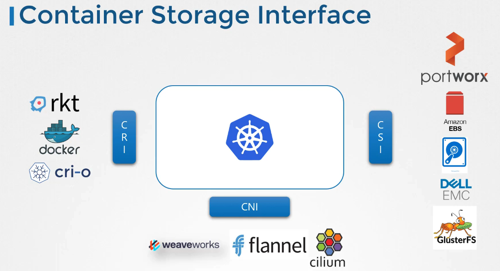

# 컨테이너 스토리지 인터페이스 (CSI)



## CSI의 개요

CSI는 컨테이너 오케스트레이션 시스템과 스토리지 시스템 간의 표준 인터페이스를 정의합니다. 이를 통해 개발자들은 쿠버네티스 소스 코드를 수정하지 않고도 다양한 스토리지 솔루션을 지원할 수 있습니다.

### CSI의 주요 기능

- **다양한 스토리지 지원**: Portworx, Amazon EBS, Azure Disk 등 다양한 스토리지 제공업체가 자체 CSI 드라이버를 제공합니다.
- **표준화된 프로토콜**: CSI는 원격 절차 호출(RPC)을 사용하여 컨테이너 오케스트레이터와 스토리지 드라이버 간의 통신을 정의합니다.

### CSI 작동 방식 예시

쿠버네티스가 새로운 볼륨을 요청할 때, 다음과 같은 RPC 호출이 이루어집니다.

```bash
# 가상의 CLI 명령어 예시
kubectl create volume --name myNewVolume
```

이 명령은 스토리지 드라이버에게 볼륨 생성 요청을 전달하고, 드라이버는 해당 요청을 처리하여 결과를 반환합니다.

## CSI의 중요성

- **확장성**: 새로운 스토리지 드라이버를 쉽게 추가할 수 있습니다.
- **호환성**: 다양한 컨테이너 오케스트레이션 플랫폼에서 동일한 CSI 드라이버를 사용할 수 있습니다.

### 참고 문서

CSI에 대한 자세한 사양은 GitHub 페이지에서 확인할 수 있습니다.

[CSI Specification GitHub](https://github.com/container-storage-interface/spec)

## 결론

CSI는 쿠버네티스를 포함한 다양한 컨테이너 오케스트레이션 플랫폼과 스토리지 솔루션 간의 호환성을 보장하기 위해 중요한 역할을 합니다. 다음 강의에서 더 많은 내용을 다루겠습니다.

## Container Storage Interface

https://github.com/container-storage-interface/spec<br/>
https://kubernetes-csi.github.io/docs/<br/>
http://mesos.apache.org/documentation/latest/csi/<br/>
https://www.nomadproject.io/docs/internals/plugins/csi#volume-lifecycle
