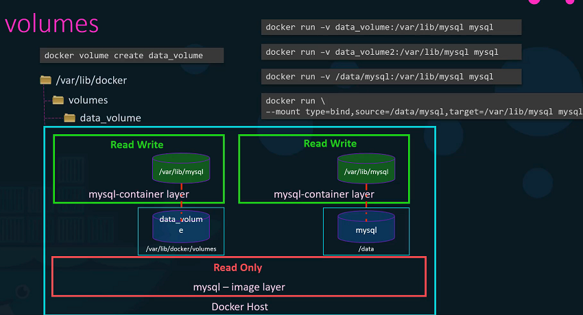

# Docker 저장 드라이버와 파일 시스템

이번 강의에서는 Docker가 데이터를 어떻게 저장하고, 컨테이너의 파일 시스템을 어떻게 관리하는지에 대해 배웁니다. Docker는 `/var/lib/docker/` 위치에 기본적으로 데이터를 저장하며, 이곳에는 여러 하위 폴더들이 있습니다.

## Docker 데이터 저장 구조

- **/var/lib/docker/**
  - **containers**: 컨테이너 관련 파일이 저장됩니다.
  - **images**: 이미지 파일이 저장됩니다.
  - **volumes**: 도커 볼륨이 생성됩니다.

## Docker 이미지의 레이어드 아키텍처

Docker 이미지는 레이어드 아키텍처를 사용하여 구축됩니다. 각 Dockerfile의 명령어는 이미지의 새 레이어를 생성하며, 이전 레이어에서 변경된 부분만 저장합니다.

### 예시: Dockerfile 레이어 생성

```Dockerfile
# 기본 OS
FROM ubuntu:latest

# APT 패키지 설치
RUN apt-get update && apt-get install -y package

# Python 패키지 설치
RUN pip install flask

# 소스 코드 복사
COPY . /app

# 엔트리포인트 설정
CMD ["python", "/app/app.py"]
```

이렇게 생성된 이미지는 빌드시 재사용 가능한 레이어로 구성되어 있어, 빠르게 이미지를 재구성할 수 있습니다.

## Docker 볼륨과 바인드 마운트

데이터를 영구적으로 저장하기 위해 Docker는 볼륨을 사용할 수 있습니다. 볼륨을 사용하면 컨테이너가 삭제되더라도 데이터를 보존할 수 있습니다.

### 볼륨 생성 및 마운트 예시



```bash
# 볼륨 생성
docker volume create my_volume

# 볼륨을 컨테이너에 마운트
docker run -v my_volume:/var/lib/mysql mysql
```

### 바인드 마운트 사용 예시

```bash
# 호스트의 특정 폴더를 컨테이너에 마운트
docker run -v /data/mysql:/var/lib/mysql mysql
```

## 요약

- Docker는 `/var/lib/docker/` 아래에 데이터를 저장합니다.
- 이미지는 레이어드 아키텍처로 구성되어 있어 효율적으로 관리됩니다.
- 데이터의 영구 저장을 위해 볼륨을 사용할 수 있으며, 필요에 따라 바인드 마운트를 사용할 수도 있습니다.

## Docker References

https://docs.docker.com/storage/
https://docs.docker.com/engine/reference/commandline/volume_create/
https://docs.docker.com/engine/reference/commandline/volume_ls/
