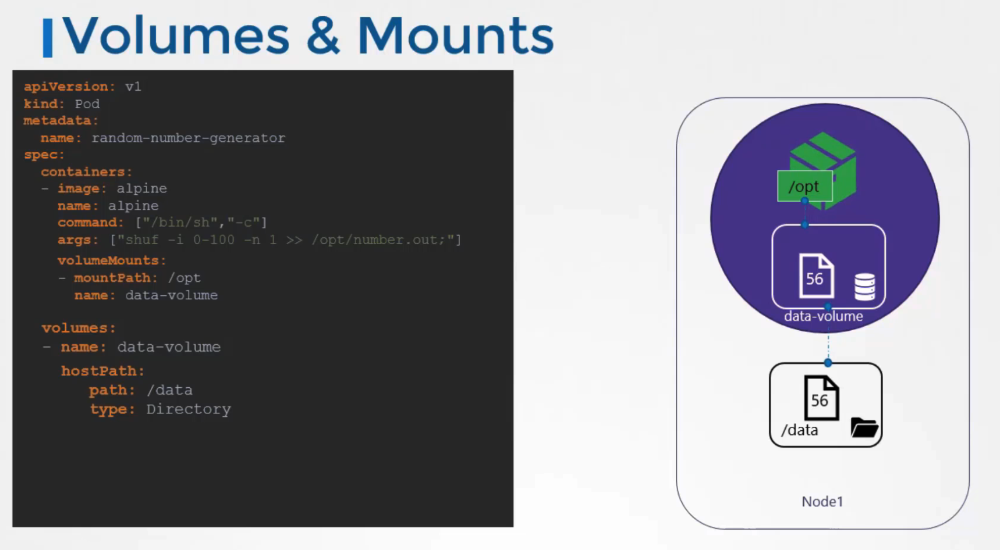
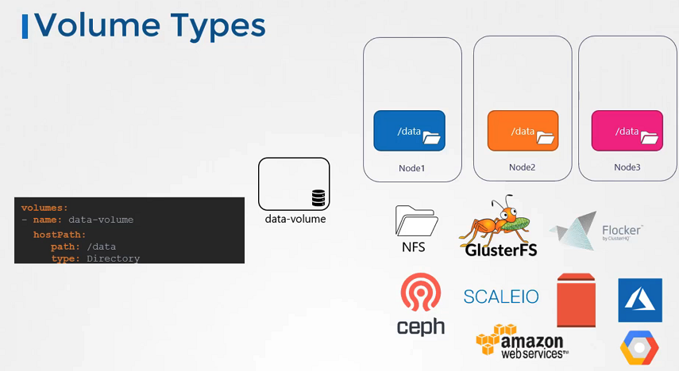

# 쿠버네티스에서의 볼륨과 퍼시스턴트 볼륨

## 볼륨의 개념

쿠버네티스에서의 볼륨은 도커에서와 같이, 컨테이너가 삭제되어도 데이터를 유지할 수 있는 방법을 제공합니다. 볼륨은 컨테이너와 독립적으로 존재할 수 있으며, 컨테이너가 삭제되더라도 볼륨에 저장된 데이터는 보존됩니다.

### 간단한 볼륨 구현 예시

쿠버네티스 클러스터에서 임의의 숫자를 생성하고 저장하는 간단한 파드를 만들어 보겠습니다. 다음은 이를 위한 파드 설정입니다.

```yaml
apiVersion: v1
kind: Pod
metadata:
  name: random-number-generator
spec:
  containers:
    - name: random-number-container
      image: alpine
      command: ["/bin/sh", "-c"]
      args: ["shuf -i 0-100 -n 1 >> /opt/number.out"]
      volumeMounts:
        - name: data-volume
          mountPath: /opt
  volumes:
    - name: data-volume
      hostPath:
        path: /data
        type: Directory
```

이 파드는 `/opt/number.out`에 임의의 숫자를 저장합니다. 호스트의 `/data` 디렉토리에 데이터를 저장하여, 파드가 삭제되어도 숫자가 유지됩니다.


## 볼륨의 저장 옵션

쿠버네티스는 다양한 저장 옵션을 지원합니다. 예를 들어, AWS EBS, Azure Disk, NFS 등을 통해 볼륨을 구성할 수 있습니다. 다음은 AWS EBS를 사용하여 볼륨을 구성하는 예시입니다.

```yaml
apiVersion: v1
kind: PersistentVolume
metadata:
  name: aws-ebs-volume
spec:
  capacity:
    storage: 10Gi
  accessModes:
    - ReadWriteOnce
  awsElasticBlockStore:
    volumeID: "<volume-id>"
    fsType: "ext4"
```

이 설정은 AWS의 EBS 볼륨을 쿠버네티스 파드에 연결하는 방법을 보여줍니다.

## 퍼시스턴트 볼륨과 퍼시스턴트 볼륨 클레임

쿠버네티스는 퍼시스턴트 볼륨(PV)과 퍼시스턴트 볼륨 클레임(PVC)을 통해 스토리지를 더욱 유연하게 관리할 수 있습니다. PV는 클러스터 내의 스토리지를 정의하는 반면, PVC는 해당 스토리지에 대한 요구 사항을 정의합니다.

```yaml
apiVersion: v1
kind: PersistentVolumeClaim
metadata:
  name: my-pvc
spec:
  accessModes:
    - ReadWriteOnce
  resources:
    requests:
      storage: 8Gi
```

PVC는 사용자의 스토리지 요구 사항을 정의하며, 적절한 PV와 자동으로 연결됩니다.

## Volume Storage Options

- 볼륨에서 호스트경로 볼륨 유형은 단일 노드에서는 괜찮습니다. 멀티 노드 클러스터에는 사용하지 않는 것이 좋습니다.
- 쿠버네티스에서는 NFS, GlusterFS, CephFS 또는 AWS EBS, Azure Disk 또는 Google의 퍼시스턴트 디스크와 같은 퍼블릭 클라우드 솔루션과 같은 여러 유형의 표준 스토리지 솔루션을 지원합니다.
  

```yaml
volumes:
  - name: data-volume
    awsElasticBlockStore:
      volumeID: <volume-id>
      fsType: ext4
```

## Kubernetes Volumes Reference Docs

https://kubernetes.io/docs/concepts/storage/volumes/<br/>
https://kubernetes.io/docs/tasks/configure-pod-container/configure-volume-storage/<br/>
https://unofficial-kubernetes.readthedocs.io/en/latest/concepts/storage/volumes/<br/>
https://kubernetes.io/docs/reference/generated/kubernetes-api/v1.18/#volume-v1-core
