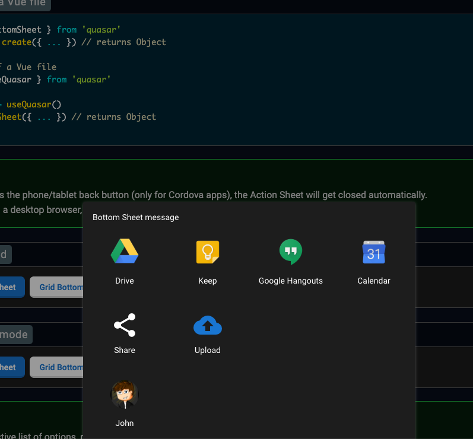

# Bottom Sheet Plugin

https://quasar.dev/quasar-plugins/bottom-sheet
  
디바이스 화면 하단 가장자리에서 위로 슬라이드되며, 작업을 확인하거나 취소할 수 있는 옵션 세트를 표시합니다. 하단 시트는 메뉴의 대안으로 사용할 수 있지만 탐색용으로 사용해서는 안 됩니다.  
하단 시트는 항상 페이지의 다른 구성 요소 위에 표시되며 기본 콘텐츠와 상호 작용하려면 해제해야 합니다. 하단 시트가 트리거되면 페이지의 나머지 부분이 어두워져 하단 시트 옵션에 더 집중할 수 있습니다.  
하단 시트는 목록이나 그리드, 아이콘 또는 아바타로 표시할 수 있습니다. Vue 파일 템플릿의 구성 요소로 사용하거나 전 세계적으로 사용할 수 있는 방법으로 사용할 수 있습니다.
