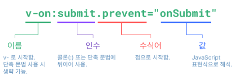

# Template Syntax

## Text Interpolation

```vue
<script setup>
import { ref } from "vue";

const msg = ref("hellow world");
</script>

<template>
  <span>메세지: {{ msg }}</span>
</template>
```

## Raw HTML

```vue
<template>
  <p>텍스트 보간법 사용: {{ rawHtml }}</p>
  <p>v-html 디렉티브 사용: <span v-html="rawHtml"></span></p>
</template>
```

v-html은 directive라고 하여 DOM에 반응형을 적용할 수 있습니다.

## Attribute Bindings

```vue
<script setup>
const objectOfAttrs = {
  id: "container",
  class: "wrapper",
};
</script>

<template>
  <div :id="dynamicId"></div>

  <!-- 3.4버전 이상 이름이 같으면 사용가능  -->
  <div :id></div>

  <!-- true면 disable, false에 속할 경우는 반대로 -->
  <button :disabled="isButtonDisabled">버튼</button>

  <!-- 동적 바인딩 -->
  <div v-bind="objectOfAttrs"></div>
</template>
```

## JavaScript 표현식 사용

```vue
<template>
  {{ number + 1 }}

  {{ ok ? "예" : "아니오" }}

  {{ message.split("").reverse().join("") }}

  <div :id="`list-${id}`"></div>

  <!-- 함수도 호출 가능 -->
  {{ formatDate(date) }}
</template>
```

## 디렉티브

[빌트인 디렉티브](https://ko.vuejs.org/api/built-in-directives.html)

### 인자

`v-bind`는 `:`, `v-on`은 `@`로 줄여 쓸 수 있습니다.

```vue
<template>
  <a v-bind:href="url"> ... </a>
  <!-- 단축 문법 -->
  <a :href="url"> ... </a>

  <a v-on:click="doSomething"> ... </a>
  <!-- 단축 문법 -->
  <a @click="doSomething"> ... </a>

  <!-- 동적 인자 -->
  <a v-bind:[attributeName]="url"> ... </a>
  <!-- 단축 문법 -->
  <a :[attributeName]="url"> ... </a>
</template>
```

### 수식어



## reference

https://ko.vuejs.org/guide/essentials/template-syntax.html
