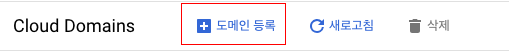

# Cloud Domains

네트워크 서비스 - Cloud Domains

## 도메인 등록

상단의 도메인등록을 하시면 도메인을 쉽게 구매할 수 있습니다.

## DNS 선택

Cloud Domains에서 구매한 도메인은 3가지 방법 중 택 1해서 DNS를 관리할 수 있습니다.

- Cloud DNS: GCP에서 메뉴가 있어서 쉽게 관리 할 수 있습니다. 주로 이걸 사용합니다.
- Google Domains: Workspace에 있는 메뉴 같은데 관리가 어려워 잘 사용하지 않습니다.
- 커스텀 네임서버: 보통 해당 도메인을 다른 곳으로 옮길 때 사용합니다.
