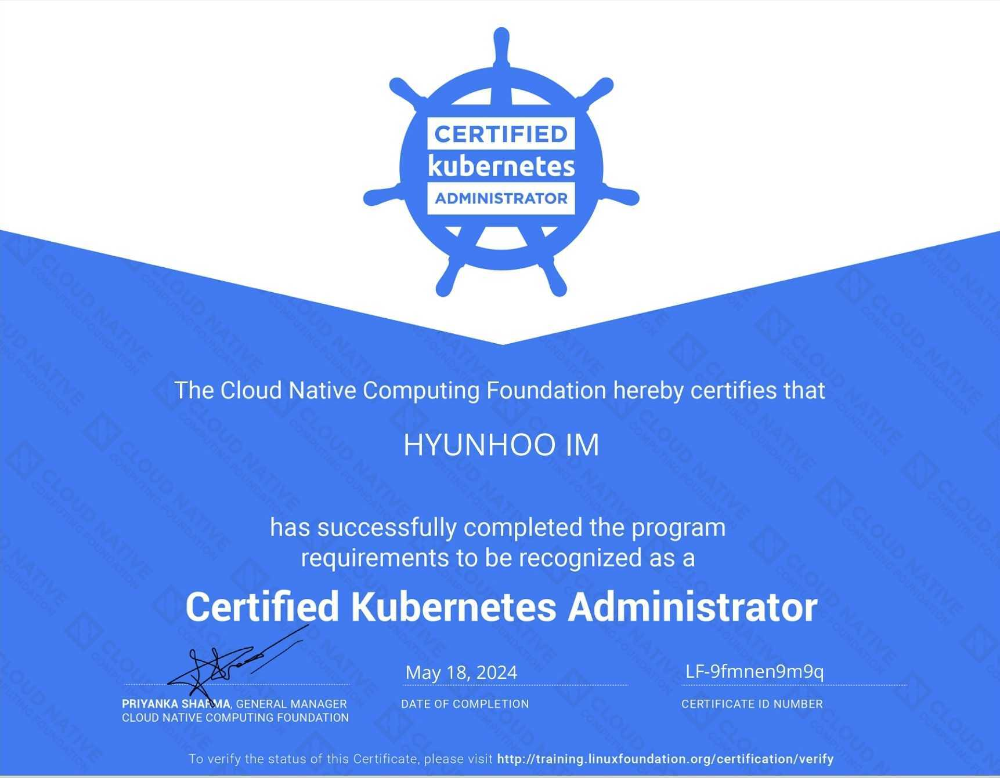
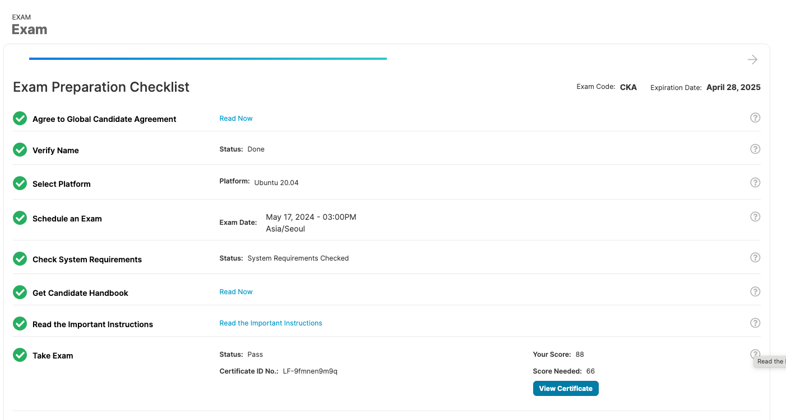

# Certified Kubernetes Administrator (CKA)

## 시험후기

CKA 자격을 획득한지는 조금 되었는데 곧바로 EKS에 관련된 강의를 듣느라 최근에 블로그 올리는게 늦었던 것 같습니다.  
사설이긴 하지만 회사에서 지원을 조금만 해주었다면 좋았겠는데 그런거 없이 모두 자비로 하였습니다.  
저는 Udemy의 [Certified Kubernetes Administrator (CKA) with Practice Tests](https://www.udemy.com/course/certified-kubernetes-administrator-with-practice-tests) 강의를 들으면서 준비하였습니다.  
영문으로 되어 있는데 한글자막이 워낙 엉망이라 부족한 실력이지만 영어로 자막과 대본을 보았고 특히 chatgpt가 큰 도움이 되었습니다.  
chatgpt에게 역할을 쿠버네티스 전문 강사로 부여하고 초보자에게 알려주는 형식으로 prompt를 작성하여 대본을 chatgpt에게 한글로 번역하여 정리해달라고 하였습니다.  
덕분에 쿠버네티스에 대한 전체적인 그림을 그릴 수 있엇고 이해도 빨랐습니다.  
그리고 Lighting Labs와 Mock Exams를 외울정도로 반복해서 풀었고 CKA를 등록하면 2번 할 수 있는 Mock도 모두 풀어보았습니다.  
개인적으로는 모두 도움이 많이되었습니다. 특히 CKA를 등록하면 2번 할 수 있는 Mock은 시험과 유사한 환경으로 풀어볼 수 있어 좋았습니다. (시험문제가 좀 난해해서 첫번째 볼때는 44점을 맞았는데 두번째 볼때는 84점을 맞았던 것 같습니다.) 
시험을 볼 때 인터넷을 검색해 봤을때 모니터 1개까지 가능하다고 했던 것 같은데 맥북을 모니터로 연결했더니 안된다고 나와 결국 그냥 맥북으로만 보았습니다.  
여권 준비하고 집안 여러군데 다 찍고 집안에 사진 같은 것이 냉장고에 붙어 있었는데 그런것도 다 떼라고 합니다.  
시험 보는 중간에 제 버릇이 생각을 하면 턱이나 입을 문지르는 버릇이 있는데 그때 하지말라고 팝업 뜹니다.  
또 아파트에서 안내방송 나왔는데 이건 뭐냐고 시험이 잠깐 중단도 되었습니다. 
시험자체는 잘 준비한다면 그렇게 어렵지는 않습니다. 물론 시험을 본다는 부담감으로 생각이 안나서 당황할 수도 있는데 그럼 그냥 넘어가면 됩니다. 어차피 66점만 넘으면 됩니다.  
저는 시험문제를 다 풀었는데 시간이 30분이상 남았고 중간에 헷갈렸던 것들을 다시 검토하면서 문제를 다시 풀었습니다. 

결과는 88점을 맞아 CKA를 획득하였습니다.  
회사다니면서 자격증 준비하기가 쉽지는 않았는데 좋은 결과를 얻으니까 참 기분이 좋습니다.  
이제 AWS EKS와 NestJs를 사용해서 실제 구현하는 것을 해보려고 합니다.
