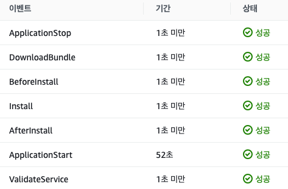

# 험난한 GCP에서 AWS로의 서비스 이전

## 계열사 변경

이전 회사를 2년정도 다닌 것 같다. 2년 중에도 다른 계열사로 이동했었다.<br/>
그런데 이번에는 같은 계열사이긴 한데 완전 다른 회사로 바뀌었다.<br/>
계열사 이동하면서 가장 큰 변화는 Cloud 환경이었다.<br/>
기존은 GCP를 썼는데 이동한 회사는 AWS를 사용했다.<br/>
이제 GCP에서 AWS로 서비스를 이전하는 험난한 모험의 과정에 대해 그을 써볼까한다...<br/>
힘드러따..😂🥲🤣

## Troubleshooting

### Code Deploy와 EC2가 통신이 되지 않는 상황

```text
ERROR [codedeploy-agent(39391)]: InstanceAgent::Plugins::CodeDeployPlugin::CommandPoller: Cannot reach InstanceService: Aws::CodeDeployCommand::Errors::AccessDeniedException - Aws::CodeDeployCommand::Errors::AccessDeniedException
```

모든 권한부여과 세팅이 끝났는데도 불구하고 지속적으로 연결하지 못하는 에러가 발생 했습니다.  
구글에서 검색결과 root 사용자로 AWS SDK 인스턴스 프로필에 우선적으로 사용한다고 합니다.  
그래서 root 사용자를 삭제하거나 프로필을 변경이 필요합니다.  
저는 삭제했습니다.

#### 해결방법

```sh
sudo rm -rf /root/.aws/credentials
sudo systemctl restart codedeploy-agent
```

위를 실행한 결과 code deploy가 성공한 걸 볼 수 있습니다. <br/><br/>


#### 출처

<https://velog.io/@gingaminga/AwsCodeDeployCommandErrorsAccessDeniedException><br/>
<https://stackoverflow.com/questions/37721601/aws-code-deploy-deployment-failed>
