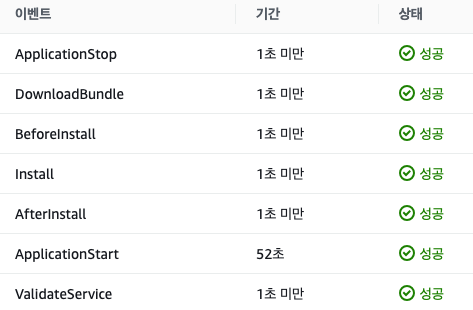

# CI/CD를 AWS로 변경

## Cloud Build와 Code Pipeline의 차이점

- Cloud Build
  - cloudbuild.yaml 파일에 CI/CD 과정을 총괄적으로 입력이 가능하다.
    - app engine으로 빌드할 때는 app.yaml 파일을 추가로 만들어야 한다.
  - 환경변수는 github 트리거에 text나 secret manager를 이용할 수 있다.
  - CI/CD 과정에 대한 모든 내용이 log에 담겨 확인하기가 편한다.
- Code Pipeline
  - tigger, source, build, deploy로 구분되어 있다.
  - 환경변수는 build의 text, Parameter Store, Secrets Manager를 사용할 수 있다.
- 느낌
  - cloud build는 파일 하나로 CI/CD 과정을 모두 컨트롤하고 로그를 쉽게 볼수 있다는 장점이 있으며 콘솔이 매우 단순화되어 있습니다. 또한, 애초에 default로 서비스계정이 있어서 서비스계정에만 권한을 부여하면 얼마든지 배포할 수 있습니다.
  - code pipeline은 과정이 눈에 보이게 세분화 되어있다는 점입니다. 조금은 cloud build보다 빠르다고 느꼈습니다. code deploy 부분에서 원하는 hook에 shell script 파일을 만들어 실행할 수가 있어서 jenkins 같은 추가적인 tool이 불필요하다 느꼈습니다. 가장 큰 단점은 초반에 세팅할것이 많습니다.

## Code Build

[CodeBuild Create](/aws/code-pipeline/code-build/build-create)  
링크와 같이 Code Build를 먼저 만들어 테스트를 해보았습니다.  
역시 처음부터 잘될일이 없죠.<br/><br/>
처음으로 문제상황이 발생했습니다.  
[Cloud Build 도중 메모리 부족으로 인해 멈추는 현상](/whoiam/company/gcp-to-aws/first-challenge#code-build-도중-메모리-부족으로-인해-멈추는-현상)<br/><br/>
두번째 문제는 build시 환경변수가 제대로 입력되지 않는 현상입니다.  
[Cloud Build에서 trigger에 넣은 환경변수를 읽지 못하는 상황](/whoiam/company/gcp-to-aws/first-challenge#code-build에서-trigger에-넣은-환경변수를-읽지-못하는-상황)<br/><br/>
세번째 문제는 테스트를 많이하면서 겪은 것인데 계정없이 이미지 push의 횟수는 참.. 많지 않았습니다. 그래서 회사 이메일로 계정하나 만들어 사용했습니다.  
[Code Build에서 ECR에서 Conatiner를 push 하지 못하는 상황](/whoiam/company/gcp-to-aws/first-challenge#code-build에서-ecr에서-conatiner를-push-하지-못하는-상황)
문제를 해결하고 S3에 가보니 build 결과가 예쁘게 놓여있습니다. :thumbsup:

## Code Deploy

- 먼저 [codedeploy-agent를 EC2에 설치](/aws/code-pipeline/code-deploy/codedeploy-agent)합니다.
- Code Deploy에 [애플리케이션을 만들고 배포그룹을 만들고 배포를 생성](/aws/code-pipeline/code-deploy/codedeploy-create) 합니다.
- 여기서도 문제가 생깁니다 :sob:<br/>
  [Code Deploy와 EC2가 통신이 되지 않는 상황](/whoiam/company/gcp-to-aws/first-challenge#code-deploy와-ec2가-통신이-되지-않는-상황)
- 문제를 해결하고 ec2에 github의 자료가 예쁘게 확인되었습니다. :thumbsup:

## Code Pipeline

드디어 마지막.. 이제 연결만하면 됩니다.

- `CodePipline > 파이프라인 > 새 파이프라인 생성`
- 파이프라인 설정
  - 파이프라인 유형: V2
  - 서비스 역할: 새 서비스 역할
- 소스
  - GitHub(버전 2)
- 트리거
  - 변경 사항을 감지하지 않음
  - push하는데로 배포하시려면 필터 지정하시면 됩니다.
- 빌드
  - 빌드 공급자: AWS CodeBuild
  - 프로젝트 이름: 위에서 만든 codebuild 사용
- 배포
  - 배포 공급자: AWS CodeDeploy
  - 애플케이션과 배포그룹: 위에서 만든 것을 사용

## Troubleshooting

### Code Build 도중 메모리 부족으로 인해 멈추는 현상

프로젝트는 추가개발이 계속되면서 NestJs와 VueJs는 계속 무거워졌습니다.  
시험삼에 EC2에서도 docker image를 build 했었는데 메모리가 부족해서 멈추는 현상이 보였습니다.  
이 현상은 Code Build에서도 동일했는데 build 도중 에러 메세지 없이 멈춰 진행이 되지 않았습니다.  
여러 방법을 찾아보았다가 Cloud Build에서는 문제없이 build가 되었던 것이 생각났고 log를 살펴보았고 아래의 코드를 발견했습니다.

```sh
npm install --package-lock-only --quiet
npm ci --quiet
```

먼저 package-lock.json 파일을 만들어 의존성 패키지를 만들고  
의존성에 맞게 clean install을 하니 build에 성공하였습니다.

```sh
NODE_OPTIONS=--max-old-space-size=4096 npm run build
```

또한 NestJs가 build시 node의 메모리를 많이 사용하여 위와같이 메모리 사이즈를 늘려주었습니다.  
이후 무난히 build에 성공하였습니다.

### Code Build에서 trigger에 넣은 환경변수를 읽지 못하는 상황

Cloud Build에서 쓰던 방식데로 환경변수를 일반텍스트로 넣었는데..  
frontend는 잘 들어가는 것 같은데 backend에 환경변수가 인식이 되지 않았습니다.  
저는 아래와 같은 방식으로 해결하였습니다.

```yml
env1: '"env"'
env2: '''{"test": "test"}'''
```

### Code Build에서 ECR에서 Conatiner를 push 하지 못하는 상황

```sh
echo $DOCKER_PASS | docker login --username $DOCKER_ID --password-stdin
```

docker hub에 가입하고 해당 계정을 환경변수로 입력하였습니다.

### Code Deploy와 EC2가 통신이 되지 않는 상황

```text
ERROR [codedeploy-agent(39391)]: InstanceAgent::Plugins::CodeDeployPlugin::CommandPoller: Cannot reach InstanceService: Aws::CodeDeployCommand::Errors::AccessDeniedException - Aws::CodeDeployCommand::Errors::AccessDeniedException
```

모든 권한부여과 세팅이 끝났는데도 불구하고 지속적으로 연결하지 못하는 에러가 발생 했습니다.  
구글에서 검색결과 root 사용자로 AWS SDK 인스턴스 프로필에 우선적으로 사용한다고 합니다.  
그래서 root 사용자를 삭제하거나 프로필을 변경이 필요합니다.  
저는 삭제했습니다.

#### 해결방법

```sh
sudo rm -rf /root/.aws/credentials
sudo systemctl restart codedeploy-agent
```

위를 실행한 결과 code deploy가 성공한 걸 볼 수 있습니다. <br/><br/>


#### 출처

<https://velog.io/@gingaminga/AwsCodeDeployCommandErrorsAccessDeniedException><br/>
<https://stackoverflow.com/questions/37721601/aws-code-deploy-deployment-failed>
